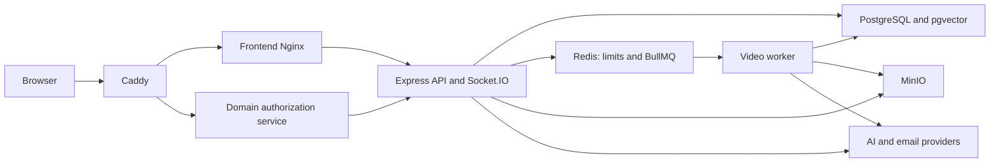

# Nudra backend audit — non-payment priorities and Paymob mock plan

Revision: 9 October 2026. Supersedes the original report for the current remediation scope; the original remains available as the full audit record.

## Verdict

**Do not launch the current backend as a production service on the VPS yet.** The overall deployment approach is workable, but reproducible authorization, concurrency, availability, certificate-integrity, and recovery defects need correction first.

This is an audit, not a remediation: no backend source code was changed. Frontend edits already present in the working tree were preserved. Findings describe commit `dd9b407909f473f8e22e2a38c9e4078559f1c428` plus the checked-out backend and deployment files inspected on this date.

The strongest findings were tested against disposable PostgreSQL, Redis, MinIO, and API/worker processes. Other findings are explicitly identified as code observations or operational risks. A passing build does not mean these defects are resolved.

### Priority definitions

- **P0 / launch blocker:** demonstrated access-control, credential, process availability, or deployment failure that should be resolved before public launch.
- **P1 / high:** material integrity, privacy, recovery, or resource-control weakness; resolve before the relevant feature receives real production traffic.
- **P2 / medium:** maintenance, scalability, observability, and defensive improvements; schedule deliberately.

Live Paymob integration is deferred by product decision and is excluded from the current implementation priorities. The non-payment defects remain unresolved. A mock can support development and demonstrations, but cannot establish real payment settlement. Finding IDs are preserved from the original report, so gaps in numbering are intentional.

This revision reuses the evidence from the earlier audit in this chat; it is not a new execution of the runtime probes. The Paymob mock described below is a proposed implementation, not an existing or verified feature.

## Architecture assessment

The backend is a TypeScript Express 4 modular monolith with PostgreSQL/pgvector, cookie-backed database sessions, Redis-backed rate limiting and BullMQ, MinIO object storage, Socket.IO community updates, and a separate video-processing worker. AI and email additionally depend on external providers.

Keeping a modular monolith and a separate compute worker is appropriate for this VPS deployment. A microservice rewrite would not fix the current problems. The architectural work needed is clearer shared authorization, domain services that own transactions, reliable background jobs, and dependency-aware operations.

**Good foundations already present:** database-backed opaque sessions; bcrypt password hashing; production secure/HTTP-only/SameSite cookies; hashed reset tokens; parameterized database access; separate migration/runtime roles; private database/storage networks; only Caddy publishing production ports; non-root, read-only, capability-restricted API/worker containers; migration advisory locking and per-file transactions; several ownership checks; transactional payment finalization; and parent-session locking in the drop-in booking path.

The main architectural weakness is policy and transaction duplication across routes. Course access, enrollment state, free lessons, booking capacity, and learning completion are interpreted differently in different endpoints. The database role can bypass RLS, so a missing application check is not caught by a second tenant boundary.

## Confirmed launch blockers

| ID | Finding and evidence | Impact | Required correction and acceptance test |
|---|---|---|---|
| B02 | **Canceled enrollments retain access in several paths.** A canceled enrollment could read lesson notes and create an AI conversation (HTTP 200). Sources: `routes/notes.ts`, `routes/ai.ts`; review `routes/videos.ts`, `routes/quizzes.ts`, and `lib/socket.ts` for the same existence-versus-active policy. | Cancellation/revocation does not reliably withdraw course benefits. | Centralize an access decision that considers active enrollment, instructor/tenant ownership, publication, approval, and intentional previews. Exercise every course-content endpoint with active, canceled, absent, and cross-organization enrollment. |
| B03 | **Unpublished content leaks through public access paths.** An unrelated student read notes for a draft free lesson by UUID. Anonymous search returned a restricted course post title and approximately 100 characters of content even though the course was unpublished. Sources: `routes/notes.ts`, `routes/search.ts`; related free-lesson branches in videos/progress/quizzes. | Draft and paid/private material can be disclosed outside its intended audience. | Public/free access must require the appropriate published/approved state; preserve explicitly permitted access for legitimate active enrollees. Test direct IDs and search, not just catalog visibility. |
| B04 | **Password-reset token consumption races.** Two simultaneous resets using one token and different passwords both returned HTTP 200. Source: `routes/auth.ts`. | A supposedly one-time credential can be consumed twice; the final credential depends on race timing. | Atomically consume the unexpired unused token inside the password-change transaction, checking affected rows. Revoke sessions and outstanding reset tokens on credential changes. A parallel test must yield exactly one success. |
| B05 | **A booking database error can terminate the API.** Temporarily hiding the scratch `course_sessions` table caused the roster route's awaited query to reject outside its error handler; the Express 4 process exited with code 1. Source: `routes/bookings.ts`. | A routine dependency/query failure becomes a whole-process outage. This test demonstrates error handling, not that a user can rename production tables. | Wrap every async route/middleware in an error-forwarding wrapper and use central sanitized error handling, or perform a carefully tested Express upgrade. Inject query errors into each route family; the request should fail safely and subsequent health requests should still work. [Express error handling](https://expressjs.com/en/guide/error-handling.html) |
| B06 | **Custom-domain TLS authorization breaks on the internal request hostname.** With the correct domain shared secret and a valid domain, `Host: api:3001` returned organization-not-found/404; `Host: nudra.example` returned 200. The domain service fetches the internal API URL, while organization resolution runs before domain authorization. Sources: `routes/domainAuthorization.ts`, `middleware/resolveOrg.ts`, `backend/src/index.ts`, production domain-auth service. | Caddy's ask service can reject legitimate new certificate issuance, including the configured root path tested. | Route internal domain authorization before public host resolution, with strict independent authentication and allowlisting. Test root and tenant domains through the actual internal service and Caddy certificate flow. [Caddy automatic HTTPS](https://caddyserver.com/docs/automatic-https) |
| B07 | **The pinned production MinIO server image cannot be pulled.** `docker manifest inspect quay.io/minio/minio:RELEASE.2025-10-15T17-29-55Z` returned `no such manifest`. Source: `compose.production.yml`. | A fresh VPS cannot start the full stack as configured. | Select an available maintained release and pin its digest after inspection. Pull/build all nine services on a clean machine. The separate `minio/mc` image check encountered DNS failure and remains unverified. |
| B08 | **The documented database transfer/restore path is broken.** The restore table-count SQL is double-quoted inside `sh`; `$$public$$`, `$$r$$`, and `$$p$$` expand to shell PIDs. Reproduced a PostgreSQL trailing-junk numeric error. The export checksum also contains the original absolute dump path, which breaks relocation to a different VPS path. Sources: `ops/restore-public-database.sh`, `ops/export-public-database.sh`. | Recovery or migration fails precisely when needed. | Use literal-safe SQL and portable basename checksums. Perform export, copy into a different directory, checksum verification, restore into an empty production-role database, migrations, and record/object checks. Syntax-only shell checks are insufficient. |
| B09 | **Certificates and study-time credit trust arbitrary client completion.** A non-enrolled student marked a draft free lesson complete with zero watched seconds and earned the one-lesson course certificate. Two zero-watch progress writes added ten study minutes. Source: `routes/progress.ts`. | Certificates and engagement statistics do not prove enrollment, attendance, or learning. | Define the actual award requirements and calculate increments from validated, bounded, idempotent activity. Require course eligibility and consistent completion criteria. Replaying requests and submitting zero progress must not create new time credit or an ineligible certificate. |

## Enrollment and booking integrity

| ID | Priority / evidence | Finding | Fix and verification |
|---|---|---|---|
| I01 | P1, reproduced | Five students enrolled concurrently into an offline course whose capacity was one. In that run, the generated session had one confirmed and four waitlisted bookings: session waitlisting did not prevent course oversubscription. `routes/courses.ts`, `lib/enrollment.ts`. | Lock a common course/capacity record in the enrollment transaction, or enforce capacity with a transactional inventory mechanism. Run concurrent enrollments and assert the chosen capacity semantics at both course and session levels. |
| I02 | P1, code | Semester enrollment and session fan-out do not share one complete transaction/locking strategy. Enrollment can commit, fan-out can fail and be logged, yet the API returns success. Cancel/fan-out/drop-in paths do not all use the same parent locks; new-session fan-out must also consider existing bookings. | Put these transitions in one domain service with consistent ordered locks and idempotency. Use a transactional outbox for deferred fan-out and expose pending/failed fulfillment. Inject failures and concurrent booking/cancellation/session creation; verify no missing or oversold roster. |

## Authentication, authorization, and privacy

| ID | Priority / evidence | Finding | Fix and verification |
|---|---|---|---|
| S01 | P1, reproduced | A previously authenticated Socket.IO connection continued joining a course room and receiving a new post after HTTP logout removed its database session. Cached identity and membership are not sufficiently revalidated; already-joined rooms can retain access. `lib/socket.ts`. | Track sockets by session; disconnect on logout/reset/expiry and authorization changes. Apply forced-password and active-enrollment rules to socket operations. Test role removal, tenant removal, cancellation, expiry, and reset on existing connections. |
| S02 | P1, code | Socket room operations lack effective event throttling/room caps and repeatedly query the database. | Bound joins, rooms, and message frequency per connection/user; validate IDs and disconnect abusive clients. Load-test event floods independently of HTTP limits. A Redis adapter becomes necessary if multiple API instances are introduced. |
| S03 | P1, reproduced/code | Anonymous replies in different subject communities produced the same anonymous token because reply scope falls back to `general`; post scope differs. HMAC configuration also permits the default `change-me` secret. `lib/anonToken.ts`, `routes/community.ts`. | Use consistent per-community scopes, require a strong production secret, and document the anonymity promise. Test subject/course separation and token stability only within the intended scope. |
| S04 | P1, verified configuration | The runtime role deliberately has BYPASSRLS. The migrated database has 37 RLS-enabled tables and zero policies; several newer tables have no RLS. This is not automatic public exposure because the VPS database is private, but RLS does not protect API tenant mistakes. | Make the server-only security boundary explicit. Keep PostgreSQL private and never expose runtime credentials. Either rigorously centralize and test tenant predicates or adopt tenant-aware RLS with a non-bypass role and safely scoped connection context. [PostgreSQL RLS](https://www.postgresql.org/docs/16/ddl-rowsecurity.html) |
| S05 | P2, code | Password change does not consistently revoke outstanding reset tokens. Password length validation is inconsistent and does not address bcrypt's byte-length behavior across endpoints. Login's delete-then-insert session replacement is not atomic. | Share credential validation; consume/revoke tokens and sessions transactionally. Test concurrent logins and specify whether multiple sessions are intended. Provide session management and expiry cleanup. |
| S06 | P2, hardening | Administrator MFA, email verification, and security-sensitive action auditing are not established as production controls. | Prioritize MFA for privileged users and audit role/domain/credential changes. Make email verification a stated product policy rather than an accidental assumption. Do not log credentials, full cookies, or reset tokens. |

## Background jobs, video, AI, and resource controls

| ID | Priority / evidence | Finding | Fix and verification |
|---|---|---|---|
| R01 | P1, reproduced | A video job with a missing raw object recorded an error in the database but BullMQ marked the job completed, because the worker catches the exception without rethrowing. `workers/transcodeWorker.ts`. | Record the failure and rethrow an Error. Configure retry/backoff for transient errors and terminal classification for bad input. Assert both database and queue state during injected failures. [BullMQ retry semantics](https://docs.bullmq.io/guide/retrying-failing-jobs) |
| R02 | P1, code | Video jobs lack a complete retry/retention/dead-letter strategy. Completed/failed queue data can accumulate in the Redis container; AOF plus a 384 MiB container limit does not provide a safe retention policy. `lib/queue.ts`, worker, compose. | Set attempts/backoff, bounded retention, stuck-job alerts, requeue tooling, and Redis memory policy suitable for queues. Test worker kill/restart, Redis restart, and replay idempotency. |
| R03 | P1, code | Different uploads for the same lesson can compete. Jobs use the same lesson HLS destination, and raw-video cleanup by lesson can remove a newer upload belonging to another job. Older work can overwrite newer results. | Give every upload a generation ID and isolated object prefix. Publish only if it remains the lesson's active generation. Cleanup exact generation-owned objects after publication. Test overlapping uploads and replacement while students are watching. |
| R04 | P1, code/operational | Upload limits bound active uploads, not the total queued workload or disk consumed after completion. Up to 2 GiB uploads, worker temporary files, retained raw media, outputs, and shared VPS volumes need explicit budgets. The worker also downloads raw content again for transcription. | Add per-organization storage quotas, queue admission limits, lifecycle cleanup, temporary-space budgets, and disk-watermark rejection. Reuse downloaded files and test full disk/failed multipart/abandoned uploads. |
| R05 | P1, code | FFmpeg execution has no robust wall-clock budget and insufficient explicit resource/input bounds. A single output profile with unbounded input resolution is not an adaptive bitrate strategy. | Bound duration/resolution/codec behavior, subprocess time and threads; kill processes on cancellation/shutdown. Scan the actual FFmpeg binary/image. Add sensible output renditions based on target devices and bandwidth after benchmarking. |
| R06 | P1, code | AI resource controls do not cover every provider-calling route. Quiz generation and exam submission can call providers outside the `/api/ai` limiter. Streams lack a complete abort/deadline/client-disconnect policy, and aggregate concurrency/spend ceilings are absent. | Place limits at a shared provider boundary: per-user/tenant/global budget, in-flight cap, output-token cap, request deadline and AbortSignal. Test abusive parallel calls, disconnects, provider stalls, and retry accounting. |
| R07 | P2, code | The custom AI limiter's separate INCR/EXPIRE operations are non-atomic and it fails open on Redis errors; the outer HTTP limiter has different failure behavior. | Use atomic scripts/transactions and explicitly choose dependency-failure behavior per route. Test expiry creation, Redis errors, and failover without silently removing costly-route controls. |
| R08 | P1, code | Flashcard regeneration deletes existing cards before provider success; failures can destroy useful material. Concurrent summary creation can duplicate provider work and hit uniqueness errors. | Generate into a versioned draft, publish transactionally after validation, and use idempotency/locking for repeated requests. Provider failure must preserve the previously published result. |
| R09 | P2, code | Quiz/exam questions and attempts do not have a sufficiently durable revision/assignment boundary for high-stakes results. Exam submission can select a subset of questions; server-side persisted exam identity/deadline is absent. | Keep this explicitly practice-only, or persist exam assignments and question revisions with server-owned question sets, timing and scoring. Test partial/replayed submissions and curriculum regeneration. |

## Performance and VPS operation

| ID | Priority / evidence | Finding | Fix and verification |
|---|---|---|---|
| O01 | P1, reproduced | `/health` returned healthy with an unreachable database. `backend/src/index.ts`. | Separate liveness from readiness. Readiness should check required dependencies with short deadlines and expose no secrets. Prove that database/Redis outages affect readiness while liveness reflects process state. |
| O02 | P1, code/config | The worker inherits the API image health check although it is not an API server. Neither worker-specific health nor adequate graceful-stop time is configured. API shutdown does not fully drain HTTP/sockets/pool/Redis. | Define worker readiness and heartbeat, remove inherited API checks, set stop grace periods, stop admission, drain or safely interrupt jobs, and close dependencies. Test deploy/restart under active streams and long video jobs. [Compose services](https://docs.docker.com/reference/compose-file/services/) |
| O03 | P1, code | PostgreSQL pool creation uses only the connection string: no deliberate connection acquisition timeout, statement timeout, idle transaction timeout, or pool error handler. Default pooling is bounded; it is not unlimited, but the total API/worker/migration connection budget is unspecified. `db/index.ts`. | Set and monitor a connection budget, short acquisition deadlines, query/transaction limits, and idle-client error handling. Test exhausted pools, slow queries, and database restarts. [PostgreSQL timeouts](https://www.postgresql.org/docs/16/runtime-config-client.html) |
| O04 | P1, code/math | HLS segments pass through Node and MinIO, with no-cache behavior and repeated authorization/database checks. The global IP limiter and slowdown also apply to media traffic. At six-second segments, one viewer makes roughly 150 requests per 15 minutes; the code slowdown threshold is 100. Shared-IP viewers can exhaust the global cap. This is arithmetic, not a load-test result. | Use a dedicated authenticated media policy and suitable cache strategy, keeping private access enforceable. Benchmark signed delivery/proxy options. Test realistic player requests and classroom/shared-NAT traffic. Do not simply make private buckets public. |
| O05 | P2, code | Media streams do not comprehensively abort upstream work on client disconnect; range/error handling needs review to avoid wasted transfers or hanging responses. | Tie object stream cancellation to response lifecycle, handle post-header errors, and test disconnects, seeks, missing segments, slow clients, and storage failures. |
| O06 | P1/P2, schema inspection | 52 foreign keys lack a general nonpartial index with the referencing column(s) at the leading edge. Some have useful partial indexes, so this count is not a claim that all 52 are wholly unindexed. Hot paths include lesson/section lookups, community reply/vote aggregation, AI message history, notifications, orders, quiz attempts, and session cleanup. | Capture `EXPLAIN (ANALYZE, BUFFERS)` on representative data and add the indexes that support real predicates/orderings and parent deletions. Review partial-index coverage rather than blindly adding 52 indexes. Vector search is also unindexed; choose exact versus approximate retrieval based on corpus size and measured recall/latency. |
| O07 | P2, code | Authentication and organization membership are sometimes queried repeatedly per request, and socket/media operations repeatedly resolve access. Pagination/bounds and query fan-out need consistent review. | Resolve a request access context once, use bounded pagination and batch aggregates, then measure query count and latency. Cache carefully with revocation semantics; avoid stale entitlement caches. |
| O08 | P1, operational | Compose caps total approximately 6.94 GiB memory and 3.75 CPUs across services. The documented 2-vCPU/8-GiB baseline leaves limited headroom when PostgreSQL, AI/video processing, storage, backups and the OS compete. These are configured ceilings, not measured consumption or throughput. | Benchmark the actual VPS with simultaneous playback, uploads, transcoding, AI, and backups. Choose resources from measurements. Initially restrict worker concurrency and define disk/CPU/memory alerts. There is no defensible supported-user count yet. |
| O09 | P1, operational | Docker logs and application data volumes lack a complete disk-retention/quota strategy. Backup scripts do not establish automated offsite database/object recovery or a tested RPO/RTO. | Rotate logs; monitor disk/inodes; back up PostgreSQL and MinIO consistently to an independent destination; encrypt and test restoration. Document retention, owners, RPO/RTO, and failure alerts. A second directory on the same VPS is not independent recovery. |
| O10 | P2, code/operational | Production observability is insufficient for reliable operations: correlated request/job IDs, structured sanitized errors, dependency latency, queue lag, failed jobs, email delivery and saturation dashboards need completion. | Add these measurements and actionable alerts before relying on the VPS unattended. Verify alerts with deliberate failures; protect operational endpoints. |

## Data design and software lifecycle

| Lifecycle | Assessment | Necessary work |
|---|---|---|
| Input and API contracts | Ad hoc validation is inconsistent. A numeric registration name returned 500 from `.trim()`; malformed UUIDs and other wrong types can reach database/application errors. Catalog/landing validation is stronger. | Apply shared schemas to body/query/params; normalize values, limit sizes and ranges, and map errors consistently to 400/401/403/404/409/422/429/5xx. Validate dates/time zones and progress fields. Monetary validation is tracked in the deferred appendix. |
| Business transactions | Many individual transactions are good, but multi-step organization/course creation, invitations, enrollment/session fan-out, and learning regeneration have partial-failure windows. | Put related writes into domain-level transactions. Use outbox delivery for email/jobs, with idempotency and observable retries. Avoid “write then compensate after provider ambiguity” as the only reliability mechanism. |
| Progress/curriculum revisions | Check-then-insert and multi-step progress recalculation can race. Adding/deleting lessons does not consistently reconcile completion/certificates; completion timestamps can become inconsistent with later flags. | Use atomic upserts and versioned eligibility rules; reconcile derived state on curriculum changes. Record award versions and intentional revocation policy. |
| Deletion and retention | Lesson deletion can orphan objects/jobs; workers can outlive deleted lessons. Course-level cleanup alone does not cover all lifecycle paths. | Define soft deletion/tombstones, cancellation and object cleanup for every entity. Make cleanup idempotent and retryable; document retention and account export/deletion policy. |
| Database migrations | All 15 migrations applied and reran successfully in scratch, including with the production migration role. Advisory locking and per-file transactions are positive. Filename-only history has no content checksum; baseline detection can skip baseline based on a small set of existing tables. The Drizzle journal lists only the initial migration while the custom runner applies later SQL. | Adopt one authoritative migration history, verify checksums, strengthen baseline validation, and test upgrades from supported historical schemas. Use expand/contract changes and a rollback/recovery plan; avoid silently applying incompatible changes during startup. |
| Testing and CI | Builds pass, but the checked-in API test suite has one stale registration fixture and is too narrow for these policies. No complete automated deployment/recovery/security regression gate was demonstrated. | Fix the fixture and add focused regressions for the confirmed findings. CI should provision disposable dependencies, apply migrations, test roles/policies/concurrency, build images and verify deployment configuration. |
| Email/invitations | Delivery depends on external configuration and is not an outbox lifecycle. Missing/failed email and ambiguous provider responses can disagree with persisted invitation/reset state. | Require production mail configuration, persist delivery jobs, retry idempotently, and observe bounces/failures. Preserve anti-enumeration behavior on password reset while alerting operators to delivery failure. |
| Dependencies | `npm audit --omit=dev` ultimately reported zero production advisories. This does not cover image OS packages, FFmpeg, application bugs, or external service behavior. | Scan built images/binaries, pin known-good digests, track maintained dependencies, and schedule tested updates. |

## Verification performed

| Check | Actual result |
|---|---|
| Backend `npm run build` | Passed. |
| Root `npm run lint` (TypeScript check) | Passed with the existing frontend working tree. |
| Fresh database migration | All 15 migrations applied; repeat run was idempotent. |
| Exact production role bootstrap/migration | Passed. Runtime role could insert/read application records but could not create a table; it is non-superuser and BYPASSRLS. Migration role is non-superuser and does not bypass RLS. |
| Checked-in API suite against live isolated stack | 6 passed, 1 failed: registration fixture omits now-required phone, giving 400 instead of 201. |
| Scratch copy of API suite with only required phone added | 7/7 passed against production-mode API. Original tests were not edited. |
| Organization landing tests with isolated environment | 4/4 passed. An earlier invocation against the older local database failed before fixture creation; the corrected isolated run is the result above. |
| Shell syntax checks | Passed; actual restore SQL still failed as described in B08. |
| Production Compose resolution | Nine services resolved; only Caddy published ports. |
| Production dependency audit | Zero advisories reported after retrying a transient network failure. |
| Security/integrity/availability probes | Earlier audit reproduced B02–B06, B08–B09, I01, S01, S03, R01 and O01 in the current scope. Financial probes B01 and I05 are retained in the deferred appendix. |
| Registry image check | MinIO server tag missing; mc check inconclusive due DNS failure. |

**Not verified:** a full production Compose boot; actual Caddy TLS issuance; paid gateway integration; live external AI/email delivery; full successful video processing under production limits; representative throughput/latency; or end-to-end backup restoration. The audit establishes neither complete vulnerability absence nor a production capacity claim.

Audit probes used disposable resources after setup. An initial development API startup invoked the existing local MinIO bucket initialization, which applies development public-read policies to media buckets; no prior policy snapshot was available. Subsequent probes used isolated MinIO, Redis, and PostgreSQL. No user objects were deleted. The first misconfigured landing-test invocation failed before writing its fixture. These setup effects are disclosed rather than described as a completely read-only runtime session.

## Recommended execution order

1. **Make deployment/recovery runnable:** fix the image pin, internal domain authorization, portable restore, readiness, async error forwarding, and shutdown behavior. Perform a clean full-stack boot and real restore before DNS cutover.
2. **Close security and learning-integrity defects:** active-enrollment policy, draft/search access, atomic reset consumption, socket revocation, and honest certificate/progress rules. Add regression tests before changing these policies.
3. **Make booking and jobs reliable:** transactional capacity, durable fan-out, generation-safe video jobs, real queue failures/retries, outbox email, and safe content regeneration.
4. **Bound resources and measure:** AI budget/concurrency, upload/storage quotas, transcoding time limits, media-specific rate policy, deliberate pool timeouts, useful indexes, disk retention, and observability.
5. **Qualify the VPS:** run the load/recovery gates below and choose limits from results. Keep unsupported exam/domain features disabled until their gates pass.
6. **Support payment demonstrations separately:** implement the mock specification below in a development or isolated staging environment. Real Paymob integration remains a later workstream.

### Minimum launch acceptance gates

- All launch-blocker regression tests pass, including parallel reset and enrollment tests.
- Fresh production images pull/build, all required services become ready, and legitimate root/custom-domain certificate issuance succeeds.
- Private content remains private for anonymous, unrelated, canceled, expired, forced-password, and cross-organization users over HTTP and existing sockets.
- A public live environment does not grant real paid entitlements from mock outcomes. Development/staging mocks are isolated and visibly labeled.
- Worker/process/database failures do not lose transitions or falsely mark work successful; queued work resumes safely after restart.
- Database plus objects restore onto a clean target, with counts, representative accounts/content and access behavior verified. Measure actual recovery time and data-loss window.
- A representative load run covers login, browsing, shared-IP HLS playback, upload/transcoding, community events, AI, and backup overlap. Record p50/p95/p99 latency, error/429 rates, pool waits, DB query plans, queue age, CPU/RAM/disk/IO, and network throughput. Set capacity below sustained saturation.
- Operators receive tested alerts for dependency outage, job backlog/failure, disk pressure, failed backup, failed mail.

This work can be done incrementally within the current architecture. The first goal is a consistent, recoverable, bounded service; architectural expansion should follow measured demand.

## Interim Paymob mock specification

### Purpose and scope

Provide a simulated checkout experience while the Paymob collaboration is pending. This is a local product mock with a provider abstraction; it is not Paymob's official sandbox, an exact reproduction of its API, or a claim of certified integration. Do not hard-code speculative Paymob endpoints or webhook fields. Confirm those against official documentation when the real integration begins.

The recommended boundary is an internal payment-provider interface with a mock implementation now and a Paymob implementation later. Checkout, order status, event processing, and entitlement rules should depend on that interface rather than a provider-specific frontend shortcut.

### Proposed user flow

1. The student selects a course or booking and opens checkout.
2. The backend creates a pending mock order using its own course/booking identity, amount and currency snapshot, owner and organization. The browser cannot set the authoritative price or settlement state.
3. A clearly labeled **Demo payment — no money charged** screen shows the order summary. Use a generic simulated checkout, without collecting actual card numbers, CVV or bank credentials.
4. An authorized tester can select **simulate success**, **simulate failure**, or **cancel**. A separate expiry scenario covers a pending checkout left unfinished.
5. The mock backend generates a stored simulated provider event. Success runs through the same internal finalization/entitlement service intended for the future provider; failure/cancellation/expiry do not grant access.
6. The return screen reads authoritative order status from the backend. A success query parameter or client redirect is never sufficient to grant access.

### Proposed state and isolation rules

| Concern | Requirement |
|---|---|
| Provider selection | Explicit mock provider configuration; no silent fallback from an unavailable real provider. |
| Environment | Development or isolated staging by default. A demo hosted on the VPS should use a separate demo database/buckets/accounts from the live application. |
| Provenance | Persist mock provider identity and simulated-event provenance. Simulated settlement must remain distinguishable from real settlement. |
| Access | Restrict outcome controls to authorized test accounts. Verify order ownership and tenant scope. |
| State transitions | Pending can become succeeded, failed, canceled, or expired; define allowed terminal behavior explicitly. Status names here are a proposed internal model, not Paymob's actual contract. |
| Idempotency | A duplicate success event must not create a second enrollment or booking; replaying failure after terminal success must not silently reverse access. |
| Event validation | Use a server-owned event record and protected internal event processing. A future provider adapter will translate authenticated provider events into this internal model. |
| Records | Store order ID, provider, event ID, amount/currency snapshot, state, actor/source, timestamps and fulfillment result. |
| Existing enrollment | Define reactivation and canceled-enrollment behavior explicitly; test it without treating an existing canceled row as successful fulfillment. |
| Cleanup | Define mock data expiry/reset without deleting live user data. |

### Mock acceptance tests

- Success grants the intended entitlement exactly once in the demo environment.
- Failure, cancellation, expiry, a forged success redirect, and a client-selected payment method grant no entitlement.
- Another student or organization cannot read or settle the order.
- Duplicate and concurrent success events remain idempotent; repeated checkout requests have deliberate behavior.
- A database failure during finalization leaves no partially fulfilled success and can be retried safely.
- Canceled enrollment reactivation has an explicit tested outcome.
- Mock data is unmistakable in UI and storage, and cannot settle a live production order.
- The application never asks for or stores real card credentials in the mock.

Implementing this mock is a separate task. This report does not enable it or change the existing test provider's production restrictions.

## Deferred financial findings and future Paymob work

These findings are preserved for later work rather than treated as fixed or removed from the audit record. They are excluded from the non-payment remediation list above. The mock's basic server-authority and isolation rules still apply during demonstrations.

| Original ID | Deferred finding | Later action |
|---|---|---|
| B01 | **Client-controlled booking payment state.** A request selecting `paymentMethod: "online"` produced a booking marked paid without a gateway transaction. Sources: `backend/src/routes/bookings.ts`, `backend/src/lib/enrollment.ts`. | Only server-confirmed payment events may create a paid state. Distinguish payment selection, pending payment, and settlement. Test that every unpaid/forged online request stays unpaid and cannot unlock paid attendance. |
| I03 | Production online checkout has no real gateway: the available test provider is blocked in production. Paid checkout consequently cannot complete. `lib/payments.ts`, `routes/payments.ts`. | Integrate the selected provider before advertising online payment. Validate signed webhooks, amount/currency/order identity, duplicate events, retries, reconciliation, and refunds. Existing transactionally guarded finalization is a useful starting point. |
| I04 | Existing canceled enrollments obstruct repurchase/reactivation: checks treat existence as enrollment and conflict handling can skip creation without restoring active state. | Model reactivation explicitly and test cancel → repurchase → verified payment → active access. Keep payment settlement and entitlement transitions in one transaction. |
| I05 | The course price schema accepts a string that bypasses numeric bounds; instructor creation with `"-100"` returned 201. There is no corresponding database nonnegative-price check. `routes/instructor.ts`, `db/schema.ts`. | Normalize and validate monetary strings into a bounded decimal representation; add database constraints. Test negative, nonfinite, excessive, malformed, and precision edge cases. |
| I06 | Booking financial state lacks a durable settlement/history model with amount snapshots and attributable adjustment/refund events. | Maintain immutable financial events with provider references, amounts/currency, actor, reason, and timestamps. Derive current state from allowed transitions; reconcile against the provider. Avoid treating a mutable status field as the entire financial record. |

When Paymob collaboration begins, confirm the available integration model and official payloads; implement credentials, authenticated callbacks, amount/currency verification, duplicate-event handling, reconciliation and refunds. Replace the mock adapter while retaining the tested internal order/entitlement lifecycle. Do not count deferred financial findings as resolved merely because a demo checkout succeeds.
